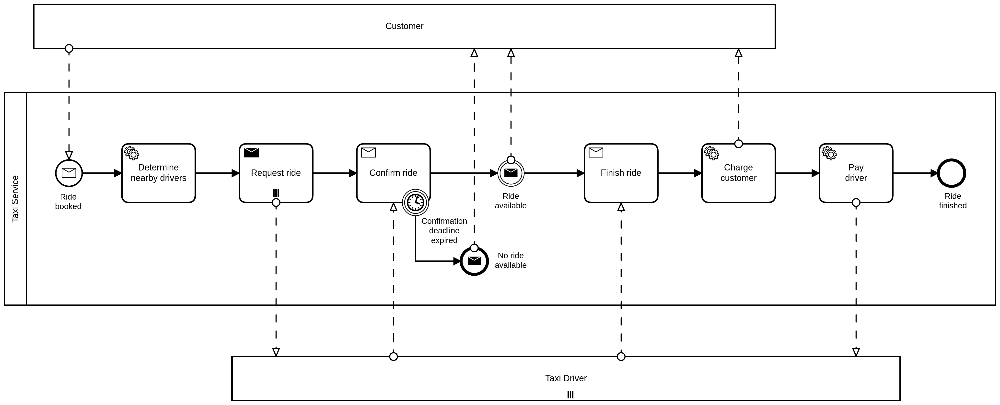

# How to Say Goodbye to Process Variables

This is a code-sample and give-away which shows a possible implementation for using certain aspects of Domain-Driven Design in the context of [Camunda](https://camunda.com/)-based business process applications. It was created for the talk *["How to Say Goodbye to Process Variables"](https://page.camunda.com/ccs2022-goodbyetoprocessvariables)* which is part of the [Camunda-Summit 2022](https://summit.camunda.com/expert-sessions/).

Since a new major release of Camunda, [Camunda 8](https://docs.camunda.io/), is a change in the underlying paradigm we will release an adapter oriented update to this repository which works with [Camunda 7](https://docs.camunda.org) as well as Camunda 8, **without any changes in your business code**. Watch this repository to get an update once the Camunda 8 adapter is released.

Content:
1. [Reasons for not using process-variables](#some-reasons-for-not-using-process-variables)
1. [Using Domain-Driven Design concepts in business-process applications](#using-aspects-of-domain-driven-design-in-business-process-applications)
1. [Usage and example](#usage-and-example)

## Some reasons for not using process-variables:

1. BPMN
   1. Process variables have no schema and therefore they cannot be documented and tested easily
   2. Using process variables, the "contract" between your BPMN model and your code can become quite intransparent
   3. No type-safety with regards to the information needed by the process
   4. Tight-coupling of the code and the business process definition
2. Operation of workflows
   1. Historic process-variables need to be cleaned up in order not to exhaust your database (even for cleaning-up itself!)
   2. Process-variables tend to pollute the execution context because typically they are not cleaned up by developers. The longer the process is running the more unused variables are stored.
   3. For call-activities, *all* process-variables are copied as a default, even including the temporary and unused variables mentioned above.
   4. Schema evolution: Process variables may have complex types and evolve over time. Migrating such values is a hard job. 

## Using aspects of Domain-Driven Design in business-process applications

### Workflow aggregate

Often there already exists some persistent entity which "belongs" to a certain process-instance.

Examples:
* Approval of vacation requests: Who, when, how long, etc.
* Clearance requests: Who, what, how long is it allowed to take, etc.
* Customer order: order-id, order items, etc.

Instead of (also) putting such values into process variables to fulfill the workflow, a little Camunda-extension makes the properties of the entity "visible" as virtual process variables.

To connect this entity 1:1 with the process, for this code-give-away the BPMN process definition key is used as the entity's class name and the process' business key is used as the entity's primary key. This way, the business key becomes another (preferred: natural) id of the process instance.

In terms of DDD we might also speak about a "root" entity of an aggregate (a small tree of connected persistent objects), which is connected with the "root" process definition of a small tree of process definitions. One could argue that such a "workflow aggregate" describes the needed structure as well as the state transitions needed to process this structure.

### Task delegates

For each kind of task a separate abstract generic class is provided having the workflow aggregate as a generic-parameter:

* `ServiceTask<P extends WorkflowAggregate>`
* `BusinessRuleTask<P extends WorkflowAggregate>`
* `SendTask<P extends WorkflowAggregate>`

The same goes for listeners:

* `UsertaskListener<P extends WorkflowAggregate>`
* `ExecutionListener<P extends WorkflowAggregate>`

This super class implements the Camunda contract of a `JavaDelegate`, first loads the workflow aggregate, then passes it to the abstract method `void process(P aggregate) throws TaskException` and persists the workflow aggregate again.

This way, your delegate code dealing with the business processing engine is separated from your business code, which makes it easier to test, to read and to maintain. Additionally, upgrading to new major releases like Camunda 8 will become easier because the business code is not mixed with the details of your BPM service implementation.

For DMN based business rule tasks, the abstract 'process' method takes a second parameter, which is the output of the DMN: `void process(P aggregate, R result)` where `R` is a generic parameter for your DMN's result type (singleEntry, singleResult, collectEntries, resultList).

### Multi-instance

For multi-instance tasks or tasks within a multi-instance context (e.g. multi-instance embedded sub processes) specialized classes are available which take the type of the collection items as a second generic parameter:

* `ServiceTaskMultiInstance<P extends WorkflowAggregate, T>`
* `BusinessRuleTaskMultiInstance<P extends WorkflowAggregate, T>`
* `SendTaskMultiInstance<P extends WorkflowAggregate, T>`

and for listeners:

* `UsertaskListenerMultiInstance<P extends WorkflowAggregate, T>`
* `ExecutionListenerMultiInstance<P extends WorkflowAggregate, T>`

During execution, an object of type `MultiInstance` is passed next to the workflow aggregate, which gives you the total number of executions, the index of the current item and - in case of collection-based multi-instances - the current collection item: `void process(O object, MultiInstance<T> multiInstanceContext) throws TaskException`.

For multi-instances, we recommend to use cardinality-based instead of collection based multi-instances, because in the second case you cannot avoid the serialization of your custom element as a process variable. Again this might lead to deserialization troubles when the properties of such an element evolve over time. It is therefore in our mind safer to only use primitive index values in the process and derive your complex java elements in your code (see *Schema evolution*).

# Usage and example

## Maven

Just add this to your project:

```
<dependency>
  <groupId>at.phactum.camunda</groupId>
  <artifactId>variable-less</artifactId>
</dependency>
```

Since this is an example implementation and not a final solution for production-ready business process applications we didn't publish this artifact to maven central. Therefore you have to put this artifact into your local repository or upload it into your private artifact-repository.

## TaxiRide example

To see all this stuff in action have a look into the taxi ride integration test:

* BPMN:
  [src/it/resources/bpmn/TaxiRide.bpmn](./src/it/resources/bpmn/TaxiRide.bpmn)
  
* Workflow-aggregate:
  [src/it/java/at/phactum/camunda/it/taxiride/domain](./src/it/java/at/phactum/camunda/it/taxiride/domain)
* BPMN tasks implementation:
  [src/it/java/at/phactum/camunda/it/taxiride/tasks](./src/it/java/at/phactum/camunda/it/taxiride/tasks)
